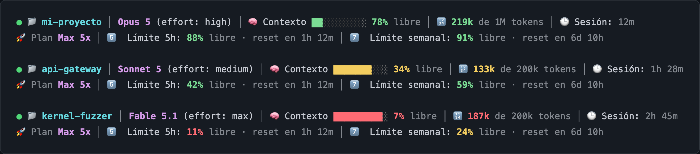

# Claude-StatusBar



Status Bar para [Claude Code](https://docs.claude.com/en/docs/claude-code/overview) escrito en bash. Dos líneas: la primera resume la sesión (carpeta, modelo, contexto, tokens, duración), la segunda la cuenta (plan detectado y rate limits). Animaciones suaves a 1 Hz.

Compatible con **Windows** (Git Bash), **macOS** y **Linux**.

## Características

**Línea 1 — sesión**

- Indicador `live` pulsante (breathing verde, 4 frames).
- 📁 Carpeta de trabajo.
- Modelo + nivel de effort actual (`Opus 5 (effort: high)`).
- 🧠 Barra de contexto que se llena según se consume (10 bloques), con shimmer recorriéndola. El color y el porcentaje indican lo que queda **libre**.
- 🔢 Tokens usados sobre el tamaño del contexto (`96k de 1M tokens`). El número se colorea con el mismo umbral que la barra: verde, amarillo o rojo según lo que quede libre.
- 🕒 Duración acumulada de la sesión.

**Línea 2 — cuenta**

- 🚀 Plan detectado automáticamente: `Pro`, `Max 5x`, `Max 20x`, `Team`, `Enterprise`. Sin suscripción muestra `Sin suscripción (API key)`.
- 5️⃣ Límite de sesión de 5 horas: porcentaje libre y tiempo hasta el reset.
- 7️⃣ Límite semanal: porcentaje libre y tiempo hasta el reset.
- 🛡 Estado del skill mcp-sentinel — solo aparece si sus archivos están instalados.

Todos los porcentajes son **libre** (lo que queda), nunca lo consumido.

## Vista previa

```
● 📁 mi-proyecto │ Opus 5 (effort: high) │ 🧠 Contexto █░░░░░░░░░ 90% libre │ 🔢 96k de 1M tokens │ 🕒 Sesión: 4m
🚀 Plan Max 5x │ 5️⃣  Límite 5h: 95% libre · reset en 1h 12m │ 7️⃣  Límite semanal: 98% libre · reset en 6d 10h
```

Con el contexto casi lleno y los límites bajos:

```
● 📁 mi-proyecto │ Fable 5.1 (effort: max) │ 🧠 Contexto █████████░ 8% libre │ 🔢 185k de 200k tokens │ 🕒 Sesión: 2h 5m
🚀 Plan Max 5x │ 5️⃣  Límite 5h: 12% libre · reset en 1h 15m │ 7️⃣  Límite semanal: 37% libre · reset en 3d 11h
```

En una cuenta sin suscripción:

```
● 📁 mi-proyecto │ Sonnet 5 │ 🧠 Contexto ░░░░░░░░░░ sin datos aún │ 🕒 Sesión: 9s
🚀 Sin suscripción (API key) │ Límites no disponibles en esta cuenta
```

## Requisitos

- **bash** 3.2+ — macOS incluye 3.2 nativo; en Windows usa [Git Bash](https://git-scm.com/downloads).
- **Python 3.6+** (`python3` o `python`) — para parsear el JSON de entrada; ya viene instalado en macOS 3.x+, la mayoría de distribuciones Linux y la descarga estándar de Windows.
- `awk`, `date`, `basename`, `tr`, `grep` — presentes en cualquier macOS, Linux o Git Bash para Windows.
- Terminal con soporte de color truecolor (24-bit). Probado en iTerm2, Terminal.app, Alacritty, Kitty, WezTerm, Windows Terminal.

## Instalación rápida

```bash
git clone https://github.com/afsh4ck/Claude-Status-Bar.git
cd Claude-Status-Bar
bash install.sh
```

El script `install.sh`:

1. Copia `custom_bar.sh` a `~/.claude/`.
2. Detecta el sistema operativo y construye la ruta absoluta correcta (Windows necesita `C:/Users/…`, macOS/Linux usan la ruta Unix directa).
3. Actualiza `~/.claude/settings.json` añadiendo el bloque `statusLine` sin tocar el resto de tu configuración.

Reinicia Claude Code una vez finalizado.

## Instalación manual

1. Copia el script y dale permisos de ejecución:

   ```bash
   cp custom_bar.sh ~/.claude/custom_bar.sh
   chmod +x ~/.claude/custom_bar.sh
   ```

2. Añade el bloque `statusLine` a `~/.claude/settings.json`:

   **macOS / Linux**
   ```json
   {
     "statusLine": {
       "type": "command",
       "command": "/Users/TU_USUARIO/.claude/custom_bar.sh"
     }
   }
   ```

   **Windows (Git Bash)**
   ```json
   {
     "statusLine": {
       "type": "command",
       "command": "bash 'C:/Users/TU_USUARIO/.claude/custom_bar.sh'"
     }
   }
   ```

   > Claude Code no expande `~` en este campo; usa la ruta absoluta completa.

3. Reinicia Claude Code (`exit` y vuelve a abrir).

## Configuración

No hay flags ni variables de entorno. Para cambiar el aspecto edita directamente `~/.claude/custom_bar.sh`:

- **Anchura de la barra**: variable `width=10`. Subir a 15 o 20 da más resolución visual.
- **Colores**: `WHT` es el blanco de las etiquetas, `DIM` el gris tenue, `SEP` el separador entre segmentos.
- **Umbrales de color**: función `color_free`. Por defecto rojo <15%, amarillo <40%, verde el resto.
- **Orden y separadores**: las variables `l1` y `l2` al final del script componen cada línea.
- **Animaciones**: `anim_frame` y `pulse_frame` calculan el frame en cada render con `date +%s % N`. Fíjalos a un valor constante para congelarlas.

## Detección del plan

El JSON del statusline **no** incluye el tipo de suscripción, así que el script lo lee de `~/.claude.json` → `oauthAccount`:

| Campo | Valor | Se muestra |
|---|---|---|
| `organizationType` | `claude_pro` | `Pro` |
| `organizationType` | `claude_max` + `organizationRateLimitTier` `default_claude_max_5x` | `Max 5x` |
| `organizationType` | `claude_max` + `organizationRateLimitTier` `default_claude_max_20x` | `Max 20x` |
| `organizationType` | `claude_team` | `Team` |
| `organizationType` | `claude_enterprise` | `Enterprise` |

Si el bloque no existe (sesión con API key, Bedrock o Vertex) se muestra `Sin plan` en gris.

## Rate limits 5h / 7d

Los segmentos `5h` y `7d` solo se rellenan cuando Claude Code incluye `rate_limits.five_hour` y `rate_limits.seven_day` en el stdin. Eso ocurre únicamente en cuentas con suscripción. En cuentas API/prepaid la línea 2 muestra `Límites no disponibles en esta cuenta`.

### Por qué no se muestra el consumo de Fable 5.1

Claude Code sí mantiene ventanas de rate limit por modelo (`seven_day_opus`, `seven_day_overage_included`, `model_scoped[]`), pero **no las pasa al statusline**: el objeto `rate_limits` del stdin solo contiene `five_hour`, `seven_day` y, en modo gateway, `spend_limit`.

Obtener el desglose por modelo exigiría llamar a `GET /api/oauth/usage` con el token OAuth del Keychain en cada render. Este script no lo hace a propósito: cero red, cero credenciales, cero latencia. Para ver el desglose por modelo usa el comando `/usage` dentro de Claude Code.

## Cómo lo verifica Claude Code

Claude Code llama al `command` configurado en `statusLine` cada ~1 segundo mientras la sesión está activa, le envía un JSON por stdin y muestra su stdout como statusline (admite varias líneas). El script no tiene estado entre renders: cada llamada parsea de nuevo el JSON. Esto permite refrescar las animaciones sin polling adicional.

Para inspeccionar el JSON que llega al script puedes añadir temporalmente al principio:

```bash
echo "$input" > /tmp/statusline_input.json
```

Y luego revisar `/tmp/statusline_input.json` después de unos segundos.

## Desinstalación

```bash
rm ~/.claude/custom_bar.sh
```

Y elimina el bloque `statusLine` de `~/.claude/settings.json` (o pon `"statusLine": null` para volver al statusline por defecto de Claude Code).

## Licencia

MIT.
